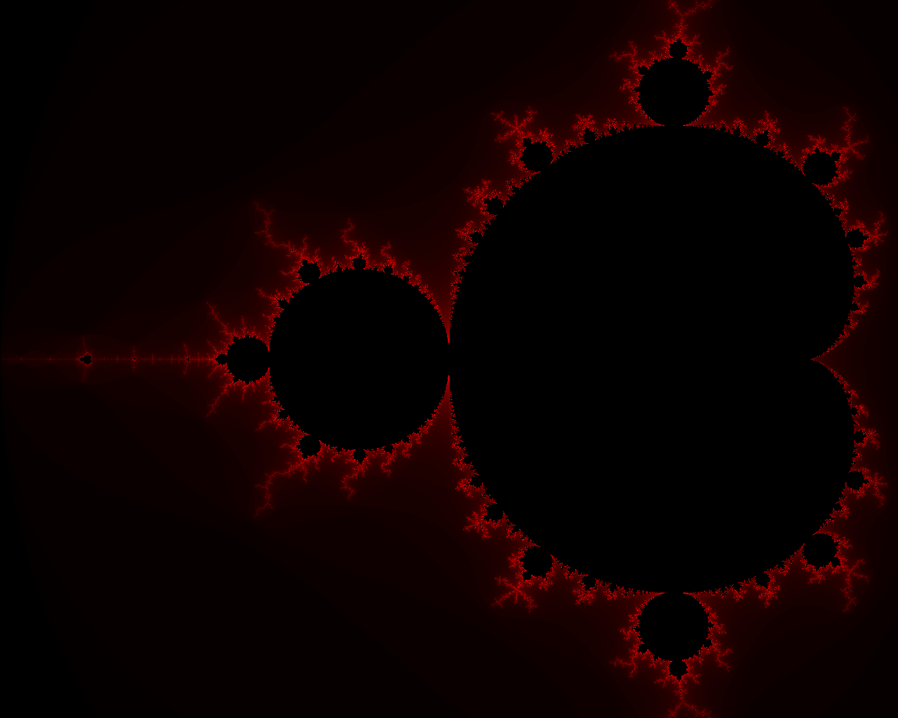

# Fractal Generator — Mandelbort Set

A small Python tool that produces renders of the Mandelbrot Set based on just several input criteria.

Different results can be achieved by changing the values in the config file. Their purpose is as follows:

* `x_max` — Farthest positive value that will be rendered on the horizontal axis
* `x_min` — Farthest negative value that will be rendered on the horizontal axis
* `y_max` — Farthest positive value that will be rendered on the vertical axis
* `y_min` — Farthest negative value that will be rendered on the vertical axis