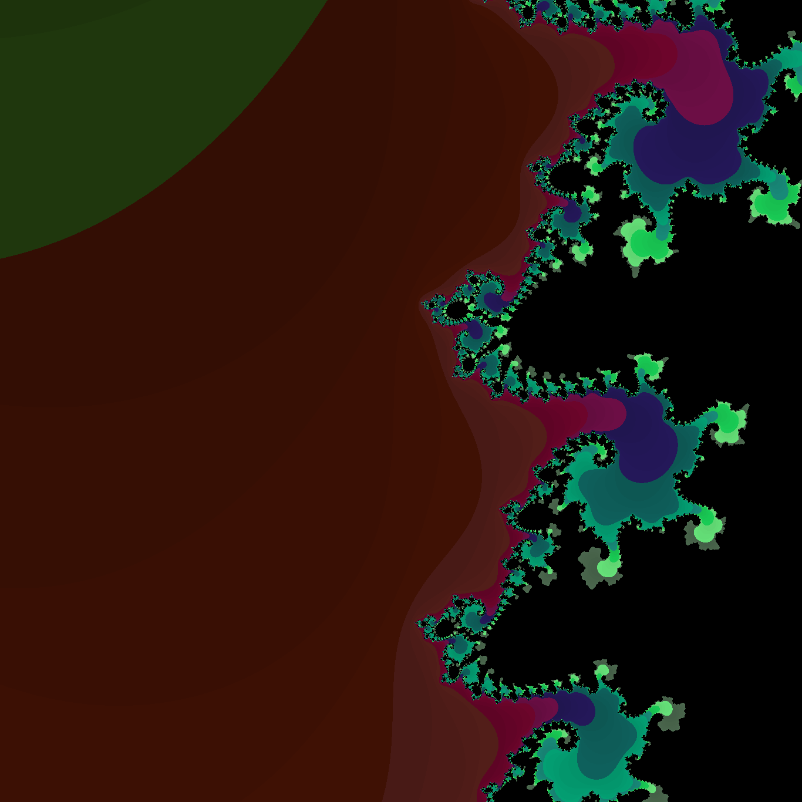

# Fractal Generator — Mandelbort Set

A small Python tool that produces renders of the Mandelbrot Set based on just several input criteria.

## Using the Tool

Different results can be achieved by changing the values in the `lib/config` file. Their purpose is as follows:

* `x_max` — Farthest positive value that will be rendered on the horizontal axis
* `x_min` — Farthest negative value that will be rendered on the horizontal axis
* `y_max` — Farthest positive value that will be rendered on the vertical axis
* `y_min` — Farthest negative value that will be rendered on the vertical axis  
* `img_width` — Width of the render in pixels — height will be automatically calculated to keep proportions extrapolated from x and y min and max
* `max_iterations` — Number of iterations that the function will go through before determining that c is within the set (provided no earlier escape)
* `escape_threshold` — The threshold after which c will be treated as not within the set — note that 2 is a conventional value, changing it can create unpredictable results

Running the main function will render an output with the specifide dimensions and save it into the `outputs/` directiory under the title generated by the time stamp.

### Rendering custom sections

While changing the values discussed above will allow for creating renders of various parts of the Mandelbrot set, it is much easier to use the set of config variables that will ask the script to render a section around a specific center point.

Note that this will *always* result in an image of 1:1 ratio.

Variables that control this behaviour are as follows:

* `custom_area` — Boolean value, needs to be set to `True` in order for the controls bellow to take effect
* `center_x` — The center of the render on the horizontal axis
* `center_y` — The center of the render on the vertical axis
* `spread` — The number that will be added to/subtracted from center values to generate `x_max`/`y_max` and `x_min`/`y_min` variables

### Stylizing the output

The style of the output for the time being is very rudimentary — it is controled by `selected_pallete` variable in the `config` file. For now it supports values of `None` for render in red channel only, or the value of `"catpuccin"` that will use the catpuccin colors.

The latter option is recommended for renders of zoomed in sections.

## The Logic Behind the Code

Mandelbrot set is a set of complex numbers that can be plotted on x, y coordinates with x corresponding to their real and y to their imaginary component — what makes them a set is the fact that they do not diverge to infinity when passed through a recursive function $f(z)=z^2 + c$.

In practice this means that as we recurse, we take note whether the result is pass some arbitrary threshold (usually 2) and if so, we determine that c is *not* in the Mandelbrot set.

For all these numbers, we also take note on how many recursions took place before they passed the threshold — this is what determines the color variations on the render.

The numbers that don't cross the threshold within the arbitrary number of steps are considered to be within the Mandelbrot set and are shown in black on the renders.

More information on the Mandelbrot set based on which the code was written can be found [here](https://en.wikipedia.org/wiki/Mandelbrot_set).